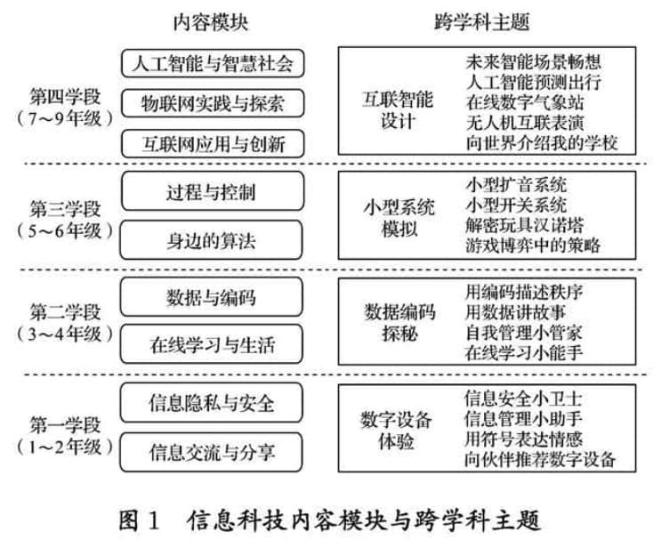

# 四、课程内容

依据核心素养和学段目标，按照学生的认知特征和信息科技课程的知识体系，围绕数据、算法、网络、信息处理、信息安全、人工智能六条逻辑主线，设计义务教育全学段内容模块，组织课程内容，体现循序渐进和螺旋式发展。

（1）数据：数据来源的可靠性一数据的组织与呈现一数据对现代社会的重要意义。

（2）算法：问题的步骤分解一算法的描述、执行与效率一解决问题的策略或方法。

（3）网络：网络搜索与辅助协作学习一数字化成果分享一万物互联的途径、原理和意义。

（4）信息处理：文字、图片、音频和视频等信息处理一使用编码建立数据间内在联系的原则与方法一基于物联网生成、处理数据的流程和特点。

（5）信息安全：文明礼仪、行为规范、依法依规、个人隐私保护一规避风险原则、安全观一防范措施、风险评估。

（6）人工智能：应用系统体验一机器计算与人工计算的异同一伦理与安全挑战。

如图1所示，具体学习内容由内容模块和跨学科主题两部分组成。“六三”学制第一学段包括“信息交流与分享”“信息隐私与安全”“数字设备体验”，第二学段包括“在线学习与生活”“数据与编码”“数据编码探秘”，第三学段包括“身边的算法”“过程与控制”“小型系统模拟”，第四学段包括“互联网应用与创新”“物联网实践与探索”“人工智能与智慧社会”“互联智能设计”。

3～8年级单独开设课程，其他年级相关内容融入语文、道德与法治、数学、科学、综合实践活动等课程。

根据“五四”学制不同学段目标要求，“五四”学制1～5年级课程应覆盖“六三”学制1～6年级绝大部分课程内容；“五四”学制6～9年级课程安排“六三”学制其余课程内容，且分布合理，为学生充分实践、探究留出时空。

## 第一学段（1～2年级）

### （一）信息交流与分享

信息科技的发展创造了全新的数字化环境。它在改变人们信息交流与分享方式的同时，也改变着人们的思维方式。本模块帮助学生认识信息交流与分享内容、方式、方法的丰富性、便捷性和独特性，并了解与之相适应的行为规范。

通过本模块的学习，学生能在日常学习与生活中借助数字设备与数字资源完成简单交流活动，辅助学习，提升效率；能在成人帮助下，通过数字设备交流、分享个人感受，发表想法，初步产生学习和使用信息科技的兴趣；在信息交流与分享的过程中知道基本的礼仪与规范，能健康、文明地使用数字设备。

**1.内容要求**

（1）在日常学习与生活场景中，通过教师指导，尝试使用数字设备与数字资源开展识字、朗读和阅读等活动，扩充语言学习的手段与方法。

（2）在家庭、校园、公园等场景中，体验、感受与智能语音助手、电子导览等数字设备的交互过程。

（3）通过拍照、录音、录像、语音输入、录入文字或图符等方式记录自己的见闻和想法，与师长、同伴交流分享。

（4）在浏览他人数字作品时，能主动、真诚、友善地发表评论，用恰当的数字化方式加以表达，如“点赞”等。

（5）通过数字设备辅助学习、交流与分享，激发对信息科技的好奇心和学习兴趣，产生对信息科技的求知欲。

（6）在学习与生活中，能用正确的姿势使用数字设备，养成好习惯，注意保护视力。

**2.学业要求**

能关心身边的信息科技给人们生活带来的变化，能使用生活中常见的数字设备帮助自己开展学习。能通过与数字设备交互的方式获取信息，解决生活中的小问题，并说出其过程。能在数字设备辅助下与师长、同伴交流。能利用数字设备获取、处理学习资源，完成学习与生活中的简单任务，初步形成利用数字设备开展数字化学习与交流的意识。在信息交流与分享中，能遵守行为规范和文明礼仪。

**3.教学提示**

教学中，教师可以创设贴近学生生活的教学情境，引导学生使用数字设备解决学习与生活中的小问题，感悟数字设备带来的新的学习方式；在数字化环境下交流与分享时，帮助学生养成友善评论、正确使用数字设备的好习惯，使学生乐于与他人分享信息。

（1）在语言教学时，教师可以引导学生使用数字设备与数字资源辅助完成学习任务，感受信息科技的优点。比如，引导学生在语言学习时，能使用数字设备与数字资源自主完成识字、阅读等任务。帮助学生尝试使用信息科技手段解决学习中遇到的问题，掌握数字设备与数字资源的基本使用方法，体验生活中的信息科技应用，树立学习和使用信息科技的意识。

例如：在学习汉字时，教师帮助学生使用“拍照识图”获得字的读音，使用学习类应用软件自主练习汉字书写的笔画顺序并得到即时检测反馈；教师还可以借助点读笔引导学生自主阅读图书，利用配音软件帮助学生练习普通话等。

（2）教师借助可交互的数字设备，如学校、公共场所的电子导览，带领学生学习和理解简单的规则，让学生能便捷地参与社会活动；在与智能语音助手交互过程中，教师可以演示语音输入、键盘输入等简单的交互方法，让学生初步体会信息科技为生活带来的便捷，进一步增强探究信息科技的兴趣。

例如：教师创设情境，组织学生与智能玩具互动游戏，借助智能语音助手、智能音箱等数字设备引导学生开展查询天气预报、收听中华传统美德故事等活动；利用生活中的扫码点餐、刷脸进门等案例，让学生说一说这些数字设备的应用过程；还可以通过在网上参观故宫博物院、敦煌石窟等数字博物馆，引导学生欣赏中华优秀传统文化。

（3）在参加校园、社区活动时，引导学生使用拍照、录音、录像、语音输入等方式记录自己的见闻和想法，并分享到数字展示平台。让学生掌握对文字、图片、声音等信息的简单处理方法，了解信息交流与分享的文明礼仪和行为规范。

例如：教师引导学生将新学校、新班级的照片分享给家人和朋友；组织学生在以小组活动的形式观察大自然时，用拍照、录像、语音输入等方式记录自己的发现、感受和想象，把见闻整理成小作品，通过班级群、班级电子平台等途径分享给同伴；倡导学生在分享过程中主动为伙伴的优秀作品“点赞”“送花”；提醒学生在交流与分享过程中用正确的姿势使用数字设备，注意保护视力，关注好习惯、好行为、好礼仪的养成。

### （二）信息隐私与安全

在信息社会中，信息隐私与安全对于个人生活、社会稳定和国家安全都是至关重要的。本模块针对学生学习和生活中的信息隐私与安全问题，阐明保障个人信息安全的重要意义，让学生养成保护个人信息和安全使用数字设备的好习惯，认识到健康、负责任地使用数字设备的重要性。

通过本模块的学习，学生能了解信息隐私与安全常识，初步体验使用信息科技手段保管个人信息的优势，认识到信息隐私与安全的重要性；能在日常学习与生活中健康、安全地使用数字设备；能懂得在网络空间与他人交流和分享信息时，需要遵守信息行为规范，逐步形成安全、负责任地使用信息科技的态度和价值观。

**1.内容要求**

（1）在各种在线活动中，能在教师指导下辨别信息真伪，知道个人信息保护的重要性，养成保护个人信息的好习惯。

（2）能对数字设备记录的文字、图片、音频、视频等信息进行分类、保存与提取。

（3）能在分享他人数字作品时标注来源，尊重数字作品所有者的权益。

（4）合理安排数字设备的使用时间，了解健康使用数字设备的重要性。

（5）在线交流时，了解在网络空间也要遵守日常行为规范。（6）在使用数字设备时不打扰他人，自觉维护社会公共秩序。

**2.学业要求**

具备辨别信息真伪和保护个人信息的意识，使用个人信息时要征得父母或教师的同意，能关注数字设备使用的健康与安全问题。能对个人的文字、图片、音频、视频等信息进行合理分类和妥善保存，利用数字化工具创作简单的数字作品。尊重数字作品所有者的权益，在与他人交流时能遵守网络礼仪。

**3.教学提示**

教学中，教师可以选用身边的案例，引导学生了解在线活动中个人信息保护的重要性，帮助学生健康使用数字设备，使学生初步具备分类、保存数字资料的能力，逐步形成尊重数字作品所有者权益和维护公共秩序的意识。

（1）通过小故事，联系真实生活情境，引导学生了解在参加各种线上活动时，要警惕网络信息诈骗，注意保护个人信息。

例如：通过“小兔子乖乖”的小故事，让学生认识到在网络应用中同样存在风险，避免网络信息诈骗；结合网站上一些免费奖励活动的情境，以“陌生人的糖果”作类比，让学生知道需要警惕网络信息诈骗。通过在类似情境中的分析、判断，让学生明白在线使用个人信息时要征得父母或教师的同意，进而认识到保护个人信息的重要性。

（2）创设生活中的问题情境，采用体验、实践的学习方式，引导学生了解信息管理的重要性。

例如，通过创设问题情境“如何管理自己生活中的各种信息”，让学生在“自己的信息自己管”的活动中，体验按文字、图片、音频、视频等形式对信息进行分类，并能利用数字设备妥善保存这些信息，初步具备管理信息的能力。

（3）通过设计探究任务，引导学生尊重数字作品所有者的权益，思考并遵守网络礼仪。

例如，设计“推选数字礼仪小榜样”的评选任务，让学生讨论、比较任务中出现的各种信息处理行为。在此过程中，学生能发现身边的同学是否尊重数字作品所有者的权益，自觉意识到要遵守网络礼仪。

### （三）跨学科主题数字设备体验

**1.向伙伴推荐数字设备**

在学校、家庭、公园、场馆等学习与生活场景中，学生有机会接触到各种不同的数字设备，如触控屏幕、智能手机、计算机、投影仪等。教师可采用模拟推介会的方式，激发学生积极主动发现与尝试各种数字设备的好奇心，引导学生接触、尝试、熟悉数字设备。学生在体验与比较之后，能用自己的语言向同伴推荐自己喜欢或新发现的数字设备，在交流分享中了解更多数字设备的用途。本主题综合运用信息科技、语文、道德与法治等知识，提升学生的信息意识和数字化学习与创新能力。

**2.用符号表达情感**

学生在与同伴进行交流时，既可以面对面地进行语言交流，也可以通过数字设备发送文字、图片、语音等。本主题引导学生用符号表达情感，如“点赞”“笑脸”“五星好评”等。让学生根据当时想表达的情绪，选择合适的一个或一组表情符号、图形符号等进行情感表征。本主题综合运用信息科技、语文、艺术等知识，让学生感受表达真实情感的不同方式，创造性地完成跨学科主题学习活动。

**3.信息管理小助手**

从生活中书桌表面的整理，到数字设备中图片、音频、视频等文件的整理，学生通过本主题学习活动形成新的意识与习惯。学生知道数字设备中的文件有些可以根据时间、地点以及格式类型进行自动分类，但这些自动分类的方式不能满足所有需求。学生能有意识地对文件进行合理分类、妥善保存、快速提取，成为信息管理的主动参与者。本主题综合运用信息科技、数学、语文、道德与法治等知识，提升学生的信息意识。

**4.信息安全小卫士**

学生在使用数字设备进行开机或登录平台时，逐步了解数字设备的权限功能。学生通过对密码的初步了解，认识到有些重要信息需要进行保护，不能轻易将密码告诉他人。有条件的学校，通过使用智能可穿戴设备（如智能手环、智能衣物、智能纽扣）、智能电子设备等，

开阔学生视野，使学生理解位置信息定位的价值与信息安全的重要性。学生通过扮演信息安全小卫士，体验“我的数字设备我做主”等学习活动，加深对信息安全与个人隐私保护的体会。本主题综合运用信息科技、道德与法治、语文等知识，提升学生的网络安全意识。

## 第二学段（3～4年级）

### （一）在线学习与生活

伴随高质量网络的飞速发展，以及大数据、云计算、人工智能的逐步普及，在线行为已经成为人们学习、生活、工作不可分割的一部分。本模块针对在线社会对人类的重要作用，阐明科技是推动在线社会发展的有效助力，培养学生利用在线方式解决问题的能力，逐步帮助学生适应在线社会的学习、生活方式，了解在线行为的安全准则。

通过本模块的学习，学生能认识到在线社会存在的意义与积极影响，能利用在线方式解决学习与生活中遇到的问题，体验信息对解决问题的帮助，初步了解在线社会的伦理规范、行为准则、道德观念和价值取向，树立正确的安全观。

本模块包括“在线生活”“在线学习”“在线安全”三部分内容。

**1.内容要求**

（1）通过生活中的在线经济、新兴媒体、人工智能等实例，感受在线社会对学习与生活的影响。

（2）针对生活中的具体需求，采用合适方式开展在线搜索，获取有用信息和资源，知道信息的常见来源及存在的重要性。

（3）对比实际案例，将生活中掌握的在线沟通与交流能力迁移到学习中，通过线上平台与他人开展协作学习活动，讨论学习规划，分20
享学习资源，感悟在线学习的便利与创新性。

（4）根据学习、生活中的任务情境，使用恰当的在线平台获取文字、图片、音频与视频等资源，设计、创作简单作品。

（5）结合学习需要，能将问题进行分解，并用文字或图示描述解决问题的顺序，利用在线方式分派任务、交流讨论、表达观点、发布成果，在解决问题的过程中体验协作带来的效率提升。

（6）能根据不同的活动要求，合理选用数字设备，学会在不同设备间复制文件的方法，并遵守数字设备的使用规范，进一步加深对资源共享的理解。

（7）认识数字身份的唯一性与信用价值，加强保护个人隐私的意识，提升在线社会中自我管理的能力。

（8）了解自主可控技术对在线行为的影响，初步形成在线社会的安全观。

**2.学业要求**

能列举在线社会对学习与生活的影响，知道在线技能的必要性，感受在线社会中信息的重要性。能合理选用数字化工具解决简单问题，能将问题分解，并用文字或图示进行描述。能在教师的指导下，利用在线方式获取学习资源并完成作品；适应在线学习环境，能通过网络完成交流，体验协作学习的过程。在网络应用过程中，知道要合理使用数字身份，浏览和传播符合社会主义核心价值观的信息，用社会公认的行为规范进行在线交流，认识自主可控技术的意义，初步认识在线社会安全观的重要性。

**3.教学提示**

在本模块教学中，教师可通过真实问题情境的创设，引导学生在解决问题的过程中感受在线社会对学习与生活的影响，让学生初步具备查找合适数字化学习平台或工具的能力，梳理解决问题的思路，发展创新意识。

（1）我国已经逐步进入在线社会，在校学生是在数字时代下成长起来的一代。因此，在教学活动中，教师可以结合我国在线社会进步的实例，让学生感受在线社会中学习与生活方式的变迁，在培养学生幸福感与从容感的同时，让学生的信息意识在活动中得到提升。

例如，组织学生以小组的形式围绕“网络聊天”“网络购物”等活动主题，调研身边的教师、家长，总结在新技术的支撑下，这些在线应用如何改变学习与生活，应该如何正确培养在线社会的行为意识，让学习更有趣、工作更高效、生活更从容。

（2）在线社会的发展给协作学习带来了前所未有的机遇与挑战。教师需要引导学生从分析问题入手，用文字或图示的方式对问题的解，决过程做分步描述，并借用在线方式分发任务、完成任务，强调计算思维的重要性。同时，教师应鼓励不同学生运用不同协作方式解决相同问题，比较不同协作方式的差异，强调数字化学习和创新性。

例如，让学生以小组的形式分析要开展的项目活动，在此基础上分工、合作，简单描述活动中的阶段性步骤，最终形成作品并进行分享。

（3）引导学生根据学习需求，查找数字化学习平台或工具，比较这些平台或工具的差异，了解数字化学习环境的优势，选用合适的平台或工具完成学习任务，让学生的数字化学习与创新得到提升。

例如，可围绕认识货币、零用钱的合理应用、储蓄意识、在线支付的发展等，指导学生通过网络查阅相关信息，引导学生了解金融的重要意义及对在线社会发展的影响，并与同伴交流心得，采用演示文稿、思维导图等方式形成作品，进行分享。

（4）结合在线社会中的应用实例，引导学生了解信息安全的重要意义，认识其中可能存在的风险，知道信息安全、自主可控技术关乎国家、社会、家庭、个人的切身利益，在社会参与中直面危机、建立使命感，通过树立正确的安全观，增强信息社会责任。

例如：通过小组活动，研讨“扫码支付”“扫码下载”“公共场所Wi—Fi使用”等在线实例，让学生知道在线社会中信息安全对我们生活的影响；通过在线方式查找、总结防范数据泄露的方法，帮助学生牢记浏览和传播数据、信息时要遵守正确的行为规范，保护自己、尊重他人，并进一步认识自主可控技术的重要性。

本模块适宜在能接入互联网的信息科技实验室中开展教学，构建便于学生交流的网络学习平台，营造良好的数字化学习氛围。此外，鼓励教师组织学生参观学校或社会场所的在线运行中心，听取专业人员的介绍，让学生对在线社会的运行方式有更直观的感受。

### （二）数据与编码

信息社会每时每刻都产生大量的数据，人们期待能依靠数据（包括大数据）提高生产效率，改善生活质量。因此，数据学与数据科学越来越受到关注。本模块针对数据（包括大数据）这种信息社会中的新型生产要素，强调数据在信息社会中的重要作用，阐明数据编码让信息得以有效利用的意义，培养学生利用信息科技解决问题的能力。本模块是信息科技课程后续学习的基础。

通过本模块的学习，学生能认识数据在信息社会中的重要作用，针对简单问题分析数据来源，应用数据解决简单的信息问题；掌握数据编码的基础知识，根据需要运用不同的编码对信息进行表达，认识数据编码的价值与意义；关注数据安全，在社会公认的信息伦理道德规范下开展活动。在本模块中，编码的目的是作为唯一标识，之后的模块中还会介绍用于其他目的的编码。

本模块包括“数字与编码”“数据与数据安全”“数据的组织与呈现”三部分内容。

**1.内容要求**

（1）通过体验和认识典型的信息科技应用场景，感受身边无所不在的数据，可以使用数字、字母或文字编码表示信息。

（2）结合真实情境，了解编码在生活中的应用，认识数据编码的目的，理解数据编码是保持信息社会组织与秩序的科学基础。

（3）通过观察身边的真实案例，知道如何使用编码建立数据间的内在联系，以便计算机识别和管理，了解编码长度与所包含信息量之间的关系。

（4）通过分析生活中的具体应用，了解数字化表示信息的优势，体验信息存储和传输过程中所必需的编码和解码步骤，初步理解数据校验的目的和意义。

（5）通过真实案例了解威胁数据安全的因素，认识自主可控技术对数据安全的影响，在学习和生活中有意识地保护数据，并遵守相关的法律法规。

（6）在对简单问题的分析过程中，使用数字化工具组织并呈现收集的数据，借助可视化方式表示数据之间的关系以支撑自己的观点。

（7）在学习与生活中，能用数据记录并描述规律性发生的事件，简单地表达自己的想法或预测结果。

**2.学业要求**

能认识到数据是现代社会的重要组成部分，根据简单问题的情境、数据的来源，以及内容表达的目的，判断数据的合理性和可靠性，认识自主可控技术对保障数据安全的意义。能根据具体应用场景，选择数字、字母或文字编码表示信息，了解编码长度与所包含信息量之间的关系，知道编码的目的是作为唯一标识、建立数据间的内在联系，以便计算机识别和准确管理。知道编码和解码是信息存储和传输的必需步骤，初步理解数据校验的目的和意义。在日常学习和生活中，能使用数字化工具收集、组织数据，并借用可视化方式呈现数据，以表达观点或预测结果。在数据的使用过程中，能遵守与信息相关的法律法规，在学习、生活中使用常见的防护措施，有意识地保护数据。

**3.教学提示**

在本模块教学中，教师可通过身边的具体事例，引导学生理解日常生活中看到的“数字”不一定都是数学中的“数值”，感受编码在计算机识别和准确管理中的作用；让学生初步具备利用数据分析结论、表达观点或预测结果的能力，并向学生渗透数据安全意识以及与信息相关的法律法规意识。

（1）引导学生通过观察和分析生活中的“数字”，明确这些“数，字”代表的不都是“数值”，还有可能是“编码”；帮助学生了解“编码”代表的是唯一标识，通过唯一标识实现对信息社会有组织、有秩序的管理。

例如，每位学生都有自己的姓名，但是在班级中还需要使用学号。因为同一个班级的学生可能出现重名，使用唯一的学号可以准确标识每位学生，便于统计和管理。

（2）通过对真实情境的案例分析，让学生知道编码的目的是建立，数据间的内在联系。编码可以用数字，也可以用字母或文字。通常编码越长，所包含的信息量越大。

例如，生活中经常会使用数字对居民楼中的每个家庭住址进行编码，如5幢3单元2楼1室可以编码表示为5—3—201，也可以表示为5—3—0201，通过对比“201”与“0201”编码方式的区别，让学生了解如何建立编码与真实世界的联系，进而体会编码中所蕴含的信息。

（3）以活动形式，让学生通过亲身实践，尝试使用数字、字母或文字编码表示信息，初步建立唯一标识的意识，体会编码和解码在信息存储及传输中的作用。活动中要注重对学生自学能力的培养。例如，教师可以将学生分为若干小组，设计不同情境，要求学生使用多种方式表示信息。小组间进行评比，鼓励学生“挑错”并给出修改方案。此外，教师还可借助分析我国居民身份证上的公民身份号码，让学生进一步体会如何使用数字、字母进行编码，并在此基础上，初步理解数据校验的目的和意义。同时，通过介绍与公民身份号码相关联的多种应用实例，帮助学生认识自主可控技术与平台对保障数据安全的重要意义，引导学生在学习和生活中有意识地保护数据。

（4）引导学生组织并呈现收集的数据，运用数据图形展示数据之间的关系并支撑自己的观点，使用数据展示因果关系、预测结果或表达想法。

教师可以将数学中与“统计与概率”有关的案例进行延伸，将多组相关数据在同一数据图形中呈现。例如，同时呈现一组数据、每个数据项与平均数的差、每个数据项与最小值的差等。引导学生收集生态数据、医疗健康（体检）数据等，启发学生多角度思考。让学生以小组的形式展开活动，体验发现问题、收集数据、组织数据、形成结论（或预测结果），以及汇报展示（或报告撰写）的全过程，同时锻炼学生的协作能力。

### （三）跨学科主题数据编码探秘

**1.在线学习小能手**

开展在线学习过程中，学生能运用文字或图示描述问题与任务，在线分派任务、交流观点、协作编辑、发布成果。通过在线学习的活动，学生能体验在线进行信息搜索、信息整合、信息加工的过程，体验线上线下学习的不同方式，初步总结自己在线学习经验，并能与同伴分享在线学习体会。本主题综合运用信息科技、语文、数学、科学等知识，实现不同课程学习主题与在线学习方式的融合。

**2.自我管理小管家**

随着身边的数字设备不断增多，学生开始在不同活动中选用不同类型的数字设备。在跨学科主题学习活动中，学生能用数据可视化的方式展示数字设备的使用时间，思考不同类型数字设备的用途；学会主动采用数字设备中自我管理的相关功能，如设置提醒闹钟、开启定时锁屏功能、自定义使用规范等；认识到需要加强对自己数字身份的保护与管理，提升自我管理的能力。本主题综合运用信息科技、数学、道德与法治等知识，提升学生的信息社会责任。

**3.用数据讲故事**

通过生活中的场景，学生尝试发现背后的数据。例如，人们对气温的直观感受是冷热变化，若用数据表示则是具体的温度数值。学生可以寻找更多真实情境，观察、记录其中的相关数据，借助数据进行预测和分析，并尝试用数据讲故事。本主题综合运用信息科技、数学、语文、科学、艺术等知识，提升学生的科学思维能力，以及表达与交流能力。

**4.用编码描述秩序**

我们所处的世界，不仅数据无处不在，编码也是如此。常见的公民身份号码就是在一套编码规则下产生的，还有座位号、条形码、二维码等，都离不开编码。在跨学科主题学习活动中，学生从编码的视角看待学习与生活中的事物，寻找给事物编码的其他实例。例如，小组合作尝试制订一个简单的编码规则，用可视化的方式解释该编码规则及作用。本主题综合运用信息科技、数学、科学、语文等知识，让学生体会数据与编码在真实情境中的应用，进一步理解编码对世界秩序的影响。

## 第三学段（5～6年级）

### （一）身边的算法

算法是计算思维的核心要素之一，也是人工智能得以普遍应用的三大支柱（数据、算法和算力）之一。本模块以身边的算法为载体，使学生了解利用算法求解简单问题的基本方式，培养学生初步运用算法思维的习惯，并通过实践形成设计与分析简单算法的能力。

通过本模块的学习，学生能熟悉一些常用的算法描述风格与方式，理解算法执行的流程；能利用自然语言、流程图等方式，描述求解简单问题的算法，并对算法的正确性与执行效率进行讨论和辨析。

本模块包括“算法的描述”“算法的执行”“算法的效率”三部分内容。

**1.内容要求**

（1）借助学习与生活中的实例，体验身边的算法，理解算法是通过明确的、可执行的操作步骤描述的问题求解方案，能用自然语言、流程图等方式描述算法。

（2）结合生活中的实例，了解算法的顺序、分支和循环三种基本控制结构，能分析简单算法的执行过程与结果。

（3）通过真实案例，知道算法步骤的执行次数与问题的规模有关，观察并体验采用不同算法解决同一问题时在时间效率上的差别。

（4）针对简单问题，尝试设计求解算法，并通过程序进行验证。

（5）以信息社会日常活动中蕴含的算法为例，讨论在线生活中算法的价值与局限（包括算法对知识产权保护的作用等），及算法对生活的指导意义。

**2.学业要求**

能用符号和编码表示问题求解所关心的对象，采用自然语言、流程图等方式，运用三种基本控制结构及其组合，正确进行问题求解的算法描述。基于给定的算法，能针对不同的输入数据规模，分别“数出”算法中某些步骤执行的次数。在此基础上，能进一步判断解决同一问题的不同算法在时间效率上的高低。能基于对算法的理解，设置和调整参数，观察相应程序的执行。基于对算法价值和局限性的认识，初步具有知识产权保护和应用安全意识。

**3.教学提示**

在本模块教学中，学生的认知发展处于从具象思维到抽象思维的过渡时期。教学实践应该把握这一阶段的特点，注重具象内容和抽象内容的关系与平衡。

（1）从学生的生活体验或《九章算术》等典籍中的适当问题出发，将算法学习的要点贯穿问题求解的过程，让学生在不同算法的具体讨论中养成算法思维，避免空洞地讲授抽象概念。

例如，猜数字游戏、物品分类、信息加密、韩信点兵、鸡兔同笼、投票选举、莫尔斯电码的翻译等，都是学生熟悉的内容。从讨论这些问题开始引入算法，学生便会形成自然的认知关联。也可以从智能家居、智能玩具等背景中提取算法问题作为教学实例。

（2）本模块要求学生体验计算机程序，鼓励学生从多个方面熟悉程序，不要求每个算法问题都由学生编程实现，阅读理解、修改运行等也都是有意义的体验。可采用类似科学课程中观察实验的教学方法，这也是培养数字化学习与创新的一种实践。

例如，对于“一笔画”“最短路径”“个性化推荐”等比较复杂的算法，教师可以在和学生一起讨论算法思想的基础上，展示由教师或第三方实现的程序代码，让学生设置和调整参数、观察讨论，最后执行验证。

### （二）过程与控制

生活中广泛存在着“输入一计算一输出”的计算模式，从外界获得的输入经过计算产生输出，进而作用于外界再影响输入，从而形成反馈系统。理解系统实现过程与控制的原理，对于理解生活中广泛存在的过程与控制系统至关重要。本模块通过学习生活中的过程与控制系统，帮助学生了解过程与控制的特征及实现方式，理解利用计算机解决问题的手段，进一步认识过程与控制系统自身的特点和规律。

通过本模块的学习，学生能认识到过程与控制广泛存在于日常生，活中，知道其中的反馈、环路、优化等概念，针对简单的过程与控制系统，能通过编程进行验证。

本模块包括“系统与模块”“反馈与优化”“逻辑与运算”三部分内容。

**1.内容要求**

（1）通过体验和认识身边的过程与控制，了解过程与控制可以抽象为包含输入、计算和输出三个典型环节的系统。

（2）通过观察身边的真实案例，了解一个大的系统可以分解为几个小的系统，一个系统也可以划分出功能相对独立的多个模块。

（3）通过分析具体案例，了解反馈是过程与控制中的重要手段，初步了解反馈对系统优化的作用。

（4）通过分析具体过程与控制系统的实例，了解系统的输入与输出可以是开关量或连续量，了解连续量可以经由阔值判断形成开关量，掌握开关量的简单逻辑运算。

（5）通过分析典型应用场景，了解计算机可用于实现过程与控制，能在实验系统中通过编程等手段验证过程与控制系统的设计。

（6）结合生活中的实例，理解过程与控制系统中存在安全问题，知道自主可控的系统在解决安全问题时起到的重要作用。

**2.学业要求**

能认识到过程与控制系统普遍存在于日常生活中。能发现大的系统可以由小的系统组成，不同的系统中存在相似的组成部分。能识别系统中的输入、计算、输出环节，能理解反馈在系统中的作用，能分辨输入与输出环节中的数据是开关量还是连续量，并能运用逻辑和数值运算设计简单的处理环节。能利用在线平台和工具寻找生活中的过程与控制场景，能设计用计算机实现过程与控制的方案，并在实验系统中通过编程等手段加以验证。能理解用计算机实现过程与控制时存在的安全问题，了解自主可控的系统在解决安全问题时的重要性。

**3.教学提示**

过程与控制是广泛存在于生活中的一种系统模型，它不仅是某些常见的电气设备的运作方式，也是一些社会经济事务的运作原理。过程与控制的教学要从生活场景出发，引导学生学会识别系统特征，分析系统构成，设计计算过程，并通过实验加以验证。

（1）学生在生活场景中能见到大量的具有过程与控制系统的设备。以学生能够理解的身边的实例为载体，将教学内容的要点串联起来，让相关思维方式具体地显现在其中。

例如，家用微波炉给食物加热的过程可以抽象为：通过输入指令设定加热挡位与加热时间，控制电路接收输入指令，计算后生成相应的工作指令，磁控管和转盘电机等按照工作指令开始工作从而加热食物。从这个案例可以看出，微波炉工作的过程分为输入、计算和输出三个环节。微波炉也可以划分出磁控管、转盘、转盘电机、继电器等功能相对独立的模块，这些模块可以完成一些细小的功能，也可以被快速替换与更新。

（2）引导学生分析具体案例，找到其中存在的反馈和环路，发现反馈作用于输出的计算方式，理解系统控制的过程。

例如，家庭空调可使房间保持凉爽的原理是：在空调通电待机时，输入制冷模式、设定的房间温度和风量等信号，空调的控制电路计算获取的输入信息，控制电路对压缩机下达制冷的工作指令，空调风口不断吹出凉风，房间温度下降；温度传感器实时检测房间温度，并传送给控制电路，控制电路比较输出与输入情况，对压缩机下达相应的工作指令，让压缩机制冷或暂停制冷，使空调内机风口吹出冷风或暂停吹出冷风，以此控制房间温度在设定的温度附近。依靠检测输出、返回与输入比较、重新调整工作部件的指令这一反馈过程，空调能够完成房间温度控制的任务。

（3）引导学生分析典型应用场景，从中发现计算机和程序的作用，通过在仿真软件或教学实验系统中的编程验证，了解用计算机实现开关量和连续量控制计算的方式。

例如，智能微波炉在机械式微波炉的基础上，使用了计算机芯片参与控制，使得控制精度和控制能力得到了极大的提升，不但控制时间更精确，而且能够实现复杂的分段火力控制，完成具有一定难度的烹饪。

（4）引导学生阅读新闻报道，了解过程与控制系统中可能会存在安全问题，知道自主可控的系统对于解决安全问题的重要性。

### （三）跨学科主题小型系统模拟

**1.游戏博弈中的策略**

生活中有各种各样的游戏，如“剪刀、石头、布”，在游戏背后都有相应的规则，规则本身也可以用算法表示。游戏博弈过程中的输赢比拼，可以采用顺序、分支、循环等基本控制结构进行算法表示。例如，多人轮流在一堆火柴棒中进行取火柴棒的博弈游戏，每人每次可以取走1～3根火柴棒，看哪位同学取到最后一根。学生可以根据游戏规则，进行算法的策略设计。本主题融合了信息科技、数学等知识，提升学生的计算思维。

**2.解密玩具汉诺塔**

生活中有很多玩具来自古老的问题，如益智玩具汉诺塔。汉诺塔一共有三根银针，在其中一根银针上有从上到下、由小到大的若干金片，要求把所有金片全部移到另一根银针上，并且金片仍然按照从上到下、由小到大的顺序排列。规定在三根银针之间移动金片时一次只能移动一个金片，并且小金片上不能放大金片。通过将抽象问题具体化的游戏，学生可以在其中感受算法的魅力，并迁移到其他生活场景的类似问题中。本主题综合运用信息科技、数学等知识，提升学生的计算思维。

**3.小型开关系统**

过程与控制系统在生活中很常见。例如，洗漱过程中，随着热水的消耗和冷水的注入，热水器里的水温度降低，当温度降低到一定程度时热水器会自动启动加热功能，这个过程就体现了通过反馈实现的过程与控制。同样地，生活中存在各种由开关控制的装置。在本主题学习活动中，学生可以通过小组合作，搭建一个简易的小型开关系统，可以通过实物实现，也可以模拟连接组建。例如，学生可以通过小组分工协作，根据生活场景所需，将声控开关系统进行选代设计。本主题综合运用信息科技、数学、科学等知识，提升学生的综合实践能力。

**4.小型扩音系统**

过程与控制系统可以实现对连续量的处理。例如，生活中水龙头柠紧的程度可以持续变化地控制水流的大小。学生可以尝试观察生活场景中的多种设备，采用相关模块硬件设备或在线上空间中模拟实现一个小型扩音系统。该系统可以连续地根据真实情境的需求，控制音量的大小。本主题综合运用信息科技、数学、科学等知识，提升学生运用过程与控制的系统方法发现问题、解决问题的能力。

## 第四学段（7～9年级）

### （一）互联网应用与创新

互联网已经成为当今信息社会的重要基础设施。互联网的出现推动着人类的学习、生活和工作由线下到线上、由物理空间向网络空间和数字空间的逐步迁移，标志着人类社会由工业社会向信息化、智慧社会的一次全球性大迁徙。基于互联网的创新创造是推动数字时代社会进步和国家发展的重要力量。本模块从互联网视角关注信息科技对学生学习、生活和未来发展的影响，强调学生适应互联网环境发展的新形态、新业态，抓住社会变革带来的机遇，提升对“没有网络安全就没有国家安全”的认识。

通过本模块的学习，学生能加深对互联网及相关新技术本质的认识，初步具备利用互联网基础设施和计算思维方法解决学习和生活中各种问题的能力，增强自觉维护网络安全与秩序的意识和责任感，全面提升数据安全意识。

本模块包括“互联网及其影响”“互联网基本原理与功能”“互联网创新应用”“互联网安全”四部分内容。

**1.内容要求**

（1）通过在线活动，分析互联网应用的特征，认识到互联网对社
会发展的创新价值和潜力。

（2）能够根据学习和交流的需要，使用互联网搜索、避选、管理并贡献有价值的数据和资源，能够创建具有特色的作品。

（3）了解常用互联网应用中数据的构成，能够使用适当的数字化工具对网页进行编辑和发布。

（4）初步了解互联网协议，知道网络中数据的编码、传输和呈现的原理。

（5）在“互联网+”情境中，体验在线学习、生活和交流的新模式，合理应用互联网提高学习与生活质量。

（6）使用互联网应用时，能够利用用户标识、密码和身份验证等措施做好基本防护，会使用加密软件对重要数据和个人信息进行加密保护。

（7）了解云存储、云计算的原理，能够使用网盘进行数据备份，认识到互联网带来的新媒体、新社交、新资源对学习和生活的影响。

**2.学业要求**

能根据学习和任务的需要，通过搜索引擎、社交媒体、短视频和协同写作等互联网工具或平台，进行较精准的信息搜索、沟通交流、协作，并贡献有价值的数据和资源。知道在常见应用中，如何编码、组织、传递、接收及验证网络数据。学会使用网页编辑工具、在线写作工具等创建网络文档，熟练利用在线课堂进行线上学习与交流，体验在线学习与生活的新模式。能从现实应用中体会互联网是如何将复杂的远程数据传输和通信等问题逐步化简为分解、编码、传输和重新组合等一系列规则（协议）的。在互联网应用中，知道如何注册或更改用户信息、设置合理的安全密码，具备识别网络谣言和不良数据的基本能力。

**3.教学提示**

互联网的构成及各种创新应用比较抽象、复杂，其背后的原理难以在义务教育阶段准确呈现和把握。教学中，教师应通过学生熟悉的互联网应用，利用现实世界中一些可理解、可类比的事物，帮助学生理解、掌握相关内容。在有条件的学校，教师应充分利用容易获得的工具，包括软件模拟器、简易开源硬件及网络分析器等，在学科专用教室或实验室中通过模拟、仿真、演示等数字化手段，营造尽量接近真实场景的各种网络环境，为学生的学习和探究创造条件。

（1）通过指导学生完成在线任务、学习使用各种网络工具等多种途径，使学生逐渐认识和了解互联网中数据的价值和特点，知道网络中数据编码、传输和呈现的直观原理，并尝试编辑加工所获取的网络信息，自主生成并共享有价值的原创网络信息。

例如，通过图解、动画等，将传统邮件与电子邮件的收发环节进行类比，辅助学生理解互联网数据的发送和接收原理，认识“协议”对于互通互联的重要价值。在开展信息搜索或网络视频播放等网络学习活动时，教师可引导学生思考在这些活动的背后，互联网TCP/IP协议是如何将复杂问题一步步分层、分解，直至细化到网络设备和具体算法能处理的程度的。

（2）互联网通过互联协议（一组共同约定并遵循的规则）将各种数字设备之间的互通互联及可靠数据传输问题进行逐层分解，每一层只完成相对简单的任务。充分利用实验室网络器材，指导学生搭建有特定功能的小型互联系统，使学生能够亲身体验互联网的组成特点和功能，认识网络协议对互联网的核心作用。让学生通过完成预设的学习任务，如安装网络软件、协作编写网络文档等，加深对互联网的理解。

（3）挑选若干具有互联网特点的典型应用，如在线课堂与在线学习、电子地图与导航工具、网络音乐和网络视频、在线协同写作等，指导学生通过与同类传统应用的对比分析，发现并逐步提炼其中的网络特性，以及互联所带来的创新功能、潜力和机会，初步体会“互联网+”对未来数字经济发展的重要意义。

（4）针对某些特定应用场景，指导学生注册用户标识、设置合理密码、严格遵循身份验证流程、使用网盘备份文件、对重要数据文件和个人隐私信息的保存及传输进行加密等，帮助学生认识网络安全的重要性，掌握保护重要数据和个人信息的基本手段。

### （二）物联网实践与探索

物联网的基本含义是“万物互联”，即在互联网的基础上，将人与人的互联延伸扩展到人与物、物与物的互联。物联网的出现极大地扩展了人们的生活、学习和工作空间，推动了物理世界与数字世界相互融合。物联网是继互联网之后的新型信息基础设施，是推动大数据和人工智能等信息科技发展与普及不可或缺的重要组成部分。

通过本模块的学习，学生能初步理解万物互联给人类信息社会带来的影响、机遇和挑战；了解物联网（特别是传感器系统）是连接物理世界与数字世界的纽带和媒介；了解物联网与互联网的异同、主要物联网协议，以及典型物联网应用的特点；能在信息科技与其他学科的学习中，有效利用基本物联网设备与平台；能设计并实现具有简单物联功能的数字系统。

本模块包括“从互联网到物联网”“物联网基本原理与功能”“物联网创新应用”“物联网安全”四部分内容。

**1.内容要求**

（1）通过实例感受万物互联的场景，知道物联网与互联网的异，同，认识到物联网的普及对学习和生活的影响。

（2）通过对身边真实应用场景中物联网的分析，认识物联网实现万物互联的基本原理。

（3）自觉遵守物联网实验的操作规程，会使用实验设备搭建物联系统原型，并能通过实验平台读取、发送、接收、汇集和使用数据。

（4）通过简易物联系统的设计与搭建，探索物联网中数据采集、处理、反馈控制等基本功能，体验物联网、大数据及人工智能的关系。

（5）了解身边的物联设备及其对塑造网络虚拟身份的作用，有意识地保护个人隐私，进行安全防护。

（6）了解物联网中发展自主可控技术的意义，了解自主可控生态体系对我国国家安全的重要作用。

**2.学业要求**

能理解万物互联的含义，知道物联网协同互联网使实时定位、远程监控、分享众筹等新型服务和应用成为可能。根据学习任务的需要和可用的实验设备，设计并搭建具有数据采集、实时传输和简单控制功能的简易物联系统。能通过智能终端或编写程序，读取并处理含有物联功能设备中的数据，并进行适当反馈或控制。初步体会物联网与大数据、人工智能之间的关系，并利用相关知识解决一些跨学科的实际问题，认识物联网中自主可控技术的重要作用。

**3.教学提示**

与互联网相比，物联网的协议、设备和终端结构简单，功能单一，直观易懂，支持物联协议的设备种类较多且容易获得，因此基于物联网的实验及应用场景比较容易搭建。根据教学需要，指导学生充分利用身边可用的实验设备设计搭建简易应用或原型系统，实现感知、交互及控制等有物联特色的功能，了解万物互联的途径，体验物联网技术的独特魅力。

（1）通过各种层次的多样化实例，包括自动驾驶、智能家居、可
穿戴设备、网络收音机、智能班牌等，帮助学生感受万物互联的场景，了解物联网的原理及与互联网的异同，了解万物互联背后的基本思想。

（2）通过分析典型物联应用、使用物联设备、搭建简易物联系统等途径，指导学生实践并掌握从物联设备中读取、发送、接收和使用数据，并了解这些过程背后的物联协议及其主要特点。

（3）物联网技术的广泛应用将带来一些全新的挑战，如集成了多种高新技术的无人机和无人驾驶车已经日趋成熟，它们所带来的一系列潜在和现实的问题已经开始显现。例如，如何协调一队无人机的飞行，使之做出一致且优雅的特技动作？又如，针对无人驾驶车、有人驾驶车混行的交会路面，如何设计最合理的会车及让行规则？

通过真实或模拟的特定场景，帮助学生了解身边的物联设备对塑造网络虚拟身份的作用，使学生养成自觉保护个人隐私、树立维护虚拟数字世界秩序的意识，并引导学生拓展思路、勇于创新，共同懂景并探究未来物联世界的奥秘。

### （三）人工智能与智慧社会

人工智能是研究和开发用于模拟、延伸和扩展人的智能的理论、方法、技术及应用系统的一门新的技术科学。本模块介绍人工智能的基本概念和术语，通过生活中的人工智能应用，让学生理解人工智能的特点、优势和能力边界，知道人工智能与社会的关系，以及发展人工智能应遵循的伦理道德规范。智慧社会是在智慧城市普遍发展基础上形成的一种新型社会形态。智慧社会包括社会经济、政府治理和能源环境等领域，通过人工智能技术的广泛应用，智能化将全面渗透到社会的各个领域。

通过本模块的学习，学生能认识和感受到人工智能的魅力，知道人工智能发展必须遵循的伦理道德规范，也能认识到智慧社会这一新型社会形态下的新机遇与新挑战。

本模块包括“人工智能的基本概念和常见应用”“人工智能的实现方式”“智慧社会下人工智能的伦理、安全与发展”三部分内容。

**1.内容要求**

（1）通过认识身边的人工智能应用，体会人工智能技术正在帮助人们以更便捷的方式投入学习、生活和工作中，感受人工智能技术的发展给人类社会带来的深刻影响。

（2）通过分析典型的人工智能应用场景，了解人工智能的基本特征及所依赖的数据、算法和算力三大技术基础。

（3）通过对比不同的人工智能应用场景，初步了解人工智能中的搜索、推理、预测和机器学习等不同实现方式。

（4）通过分析典型案例，对比计算机传统方法和人工智能方法处理同类问题的效果。

（5）通过体验人工智能的应用场景，了解人工智能带来的伦理与安全挑战，增强自我判断意识和责任感，做到与人工智能良好共处。

（6）通过各个领域的人工智能应用，了解智慧社会是集成了多种具有人工智能基础设施和服务的智能生态系统的新型社会形态，认识到为保障智慧社会的安全发展自主可控技术的必要性。

**2.学业要求**

能识别身边的人工智能应用，理解人工智能与现实社会的联系。能列举人工智能的主要术语，了解人工智能的三大技术基础，知道目前常见的人工智能实现方式。知道人工智能可能的科技发展方向和安全挑战，了解智慧社会及自主可控技术的地位。

**3.教学提示**

学生对人工智能会有想象和期待，课程要回应学生的期待。通过
身边的人工智能应用场景，引导学生正确认识人工智能，并带领学生分析具体案例，让学生对所涉及的技术基础有所了解，在实际应用的体验中体会人工智能带来的社会变化和安全挑战。

（1）引导学生寻找和发现身边的人工智能应用，体会这些应用给学习和生活带来的便利，感受人工智能技术对人类社会的深刻影响，并能在教师的帮助下分析这些应用中体现的人工智能的基本特征及技术基础。

例如，我国自主研发的围棋人工智能程序“绝艺”，多次在世界计算机围棋大赛上获得冠军。“绝艺”诞生的初衷是帮助人们更好地认识围棋、学习围棋，通过科技创新使围棋运动焕发新的生命力，让更多的人关注围棋，在围棋领域中探索、成长。又如，某些语音服务产品能根据听到的内容作出相应的回答，各种交通工具和办事窗口中常见的人脸识别设备能正确识别乘客和办事人员的身份。

通过这些案例，与学生一起探索这些人工智能产品背后涉及的数据、算法和算力三大技术基础。

（2）通过对常见人工智能应用的分类和分析，引导学生发现其中存在的不同实现方式，认识各种实现方式的计算过程，了解其适用的场景。

例如，现实生活中判断某个人能否守时，通常是回忆此人以往的守时情况，并作出大致推断。这种利用经验来估算的方法，被称为经验法，是人类使用较为广泛的方法。如果是人工智能，它将根据相关的历史数据，如历次约定的日期、具体地点、交通工具、道路的拥堵情况等，进行数据建模，作出此人能否守时的预测，这是一种典型的机器学习过程。师生可以针对这一案例，深入开展讨论，对比传统方法和人工智能方法处理同类问题的效果。

### （四）跨学科主题互联智能设计

**1.向世界介绍我的学校**

学生热爱自己的学校，希望向世界介绍自己的学校。互联网能让身处世界各地的人相互了解。学生可以综合运用不同媒介和社交媒体的表现方式，研究与对比不同数字化表现方式的功能和价值，通过编写学校互联网百科词条、创作学校相册、拍摄学校创意短视频、创建运维学校社交媒体、发布学校网页等多种方式介绍自己的学校；也可以结合时代发展分享对学校的未来规划与设计，向世界介绍自己理想中的未来学校。本主题综合运用信息科技、语文、英语、艺术等知识，让学生充满创意地完成该学习活动任务。

**2.无人机互联表演**

互联网、物联网的不断发展为现实生活创造了诸多新思维、新模式、新方法、新平台。通过实物或平台模拟，学生进行无人机群组控制，感受新兴技术在各行各业中的应用创新，体会无人机对于智能交通、智能灌溉、智能运输的作用。通过教师引导，学生以小组合作的方式，分析无人机互联焰火表演的案例，并试着提出自己的新方案，感受物联网对未来的潜在影响。本主题综合运用信息科技、数学、物理、地理等知识，让学生体会信息科技带来的变革，感受科技自主可控创新和原始创新的重要性。

**3.在线数字气象站**

天气预报是我们获取气象信息的主要途径，但是一个城市或区域的天气预报对校园这种小气候环境来说可能不够准确。通过物联网技术制作在线数字气象站，可以很好地解决这个问题。学生通过数字气象站中的各种传感器实时描绘校园气象的信息状态，探寻数据的变化规律，尝试得到一般性的结论；还可以将区域间多个数字气象站的信息进行汇总，发现更多的规律。本主题综合运用信息科技、地理、物理等知识，让学生感受在较长时间、较大空间和大量数据环境下提取有效信息、发现规律的一般过程。

**4.人工智能预测出行**

人工智能正在对人们的学习、生活与工作，特别是解决问题的思，维方式产生深刻影响。学生可以从感兴趣的问题出发设计活动，如预测在不同天气条件下，同伴会选择何种交通工具来到学校；采用多种方式收集多组数据，建构多维度数据集，初步运用人工智能的方式对同伴出行的交通工具进行预测。本主题综合运用信息科技、数学、物理、化学、生物学等知识，贴近学生生活，并能迁移到其他更多相似的场景应用中。

**5.未来智能场景畅想**

智慧社会初见端倪，互联网、物联网和人工智能等信息科技对学习、生活、工作的影响正在扩大。通过跨学科主题学习活动，学生以，小组合作的方式，立足环境变化、经济变化、能源变化等挑战性问题，大胆设想目前还没有实现的人工智能应用场景，畅想未来智能场景，设计未来智能产品方案，形成方案报告和方案可行性评估报告。教师可以采用产品方案模拟融资会、招标会、拍卖会等互动方式，运用多元评价，促进学生将发散思维与科学求证有机结合，促进科学与艺术的深度融合，引导学生正确认识人工智能对社会的影响，形成人工智能伦理、自主可控创新的意识。本主题综合运用信息科技、数学、物理、化学、生物学等知识，让学生跨学科思考，形成综合思维与创新意识。